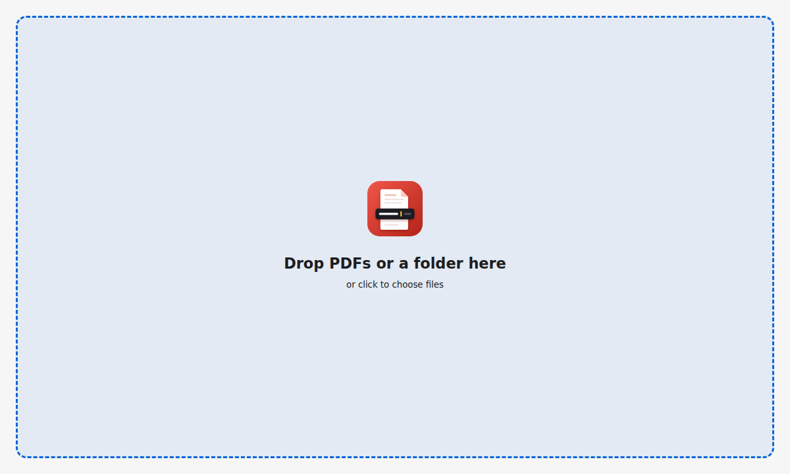

<p align="center">
  
</p>

<h1 align="center">PDF Rename</h1>

<p align="center">
  <b>Rename a stack of PDFs at typing speed, keyboard only.</b><br>
  Drop your scans, read the preview, type a name, hit <kbd>Shift</kbd>+<kbd>Enter</kbd>. Next.
</p>

<p align="center">
  <a href="https://github.com/PSum/pdf-rename/releases/latest"></a>
  <a href="https://github.com/PSum/pdf-rename/releases"></a>
  <a href="https://github.com/PSum/pdf-rename/actions/workflows/ci.yml"></a>
  
  <a href="LICENSE"></a>
</p>

<p align="center">
  <a href="https://github.com/PSum/pdf-rename/releases/latest"><b>Download</b></a> ·
  <a href="#-features">Features</a> ·
  <a href="#%EF%B8%8F-keyboard">Keyboard</a> ·
  <a href="#-development">Development</a>
</p>

<p align="center">
  <picture>
    <source media="(prefers-color-scheme: dark)" srcset="docs/screenshots/rename-dark.png">
    
  </picture>
</p>

## Why?

Scanners and download folders give you `SCAN_20260913_0042.pdf`. You want `2026-09-15 Stadtwerke Electricity.pdf`. Renaming dozens of files in Explorer or Finder means opening each one, closing it, clicking the name, typing, and repeating.

**PDF Rename puts the preview and the name field side by side.** You only type. The cursor is always in the name field, and one key press renames the file and shows the next one.

## ✨ Features

|   |   |
|---|---|
| 📂 **Drop anything** | PDFs, a folder, or both. Click the window to pick files instead. Non-PDFs are ignored, and files come in natural order (`scan2` before `scan10`). |
| 👀 **Real preview** | The whole PDF, scrollable and zoomable, rendered with pdf.js. |
| ⌨️ **Keyboard only** | The name is pre-selected, so you just type. `.pdf` is added for you. |
| 🛡️ **Safe** | Asks before overwriting, blocks names Windows can't store, and has **undo**. |
| ➕ **Add files as you go** | Drop more PDFs while renaming and they join the end of the list. |
| 💬 **Clear errors** | For example, "*is open in another program*" when Acrobat still holds a file. |
| 🌗 **Feels native** | Follows the light/dark theme, remembers its window, runs as a single instance. |
| 💻 **Cross-platform** | Windows, macOS (Apple Silicon and Intel) and Linux. |

## 📦 Download

Get the latest version from the **[Releases page](https://github.com/PSum/pdf-rename/releases/latest)**:

| | File | |
|---|---|---|
| **Windows** | `PDF Rename Setup x.y.z.exe` | Installs with Start menu and desktop shortcuts |
| **macOS** | `PDF Rename-x.y.z-arm64.dmg` / `…-x64.dmg` | Apple Silicon / Intel |
| **Linux** | `PDF Rename-x.y.z.AppImage` | `chmod +x` and run |

To update, install the new version over the old one.

<details>
<summary><b>"Windows protected your PC" / "app is damaged"?</b> The builds are not code-signed. Here's how to open them.</summary>

- **Windows:** right-click the installer → *Properties* → tick **Unblock** → OK. Or click *More info* → *Run anyway* in the SmartScreen dialog. The installed app then starts normally.
- **macOS:** right-click the app → *Open* → *Open*. If macOS says the app is damaged, run
  `xattr -cr "/Applications/PDF Rename.app"` in Terminal.
- **Linux:** `chmod +x "PDF Rename-"*.AppImage`, then start it.

</details>

## 🚀 How it works

<table>
<tr>
<td width="50%">
  <picture>
    <source media="(prefers-color-scheme: dark)" srcset="docs/screenshots/drop-dark.png">
    
  </picture>
</td>
<td>

1. **Drop** PDFs or a folder onto the window.
2. **Read** the preview and **type** the new name.
3. Press <kbd>Shift</kbd>+<kbd>Enter</kbd> to rename. The next PDF appears, and the name field is ready for typing.
4. Press <kbd>Esc</kbd> when you're done. The summary shows how many files were renamed.

</td>
</tr>
</table>

## ⌨️ Keyboard

The cursor never leaves the name field, and normal text editing keeps working (<kbd>Ctrl</kbd>+<kbd>←</kbd>/<kbd>→</kbd> jumps words, <kbd>Ctrl</kbd>+<kbd>Shift</kbd>+<kbd>←</kbd>/<kbd>→</kbd> selects words).

| Windows / Linux | macOS | Action |
|---|---|---|
| <kbd>Shift</kbd>+<kbd>Enter</kbd> or <kbd>Ctrl</kbd>+<kbd>Enter</kbd> | <kbd>Shift</kbd>+<kbd>Enter</kbd> or <kbd>⌘</kbd>+<kbd>Enter</kbd> | Rename and go to the next file |
| <kbd>Alt</kbd>+<kbd>→</kbd> | <kbd>⌘</kbd>+<kbd>⌥</kbd>+<kbd>→</kbd> | Next file (keep the name) |
| <kbd>Alt</kbd>+<kbd>←</kbd> | <kbd>⌘</kbd>+<kbd>⌥</kbd>+<kbd>←</kbd> | Previous file |
| <kbd>Ctrl</kbd>+<kbd>Alt</kbd>+<kbd>Z</kbd> | <kbd>⌘</kbd>+<kbd>⌥</kbd>+<kbd>Z</kbd> | Undo the last rename (repeatable) |
| <kbd>PgUp</kbd> / <kbd>PgDn</kbd> | <kbd>PgUp</kbd> / <kbd>PgDn</kbd> | Scroll the preview |
| <kbd>Ctrl</kbd>+<kbd>+</kbd> / <kbd>-</kbd> / <kbd>0</kbd>, <kbd>Ctrl</kbd>+wheel | <kbd>⌘</kbd>+<kbd>+</kbd> / <kbd>-</kbd> / <kbd>0</kbd> | Zoom the preview |
| <kbd>Esc</kbd> | <kbd>Esc</kbd> | Finish and show the summary |

**If the name already exists**, the app asks first: <kbd>Enter</kbd> overwrites (this can't be undone), <kbd>Esc</kbd> cancels.

**Names are checked as you type.** The app blocks `/ \ : * ? " < > |`, names ending in a dot or space, and Windows reserved names such as `CON` or `NUL`. It does this on every OS, so renamed files can be copied anywhere.

## 🛠 Development

Requires Node.js 22+. Built with Electron, electron-vite, TypeScript and pdf.js.

```bash
npm install
npm run dev            # start with hot reload
npm test               # unit tests (vitest)
npm run typecheck
npm run build          # bundle into out/
npm run e2e            # drive the built app end to end (headless Linux: xvfb-run -a npm run e2e)
npm run screenshots    # regenerate docs/screenshots from the built app
npm run icon           # render build/icon.svg to build/icon.png
```

> [!NOTE]
> On WSL/Ubuntu, Electron also needs `sudo apt-get install -y libnss3 libasound2t64`.

<details>
<summary><b>Tests</b></summary>

- **Unit tests** (`tests/`) cover the filename rules, the file access module (permissions, case-only renames, error texts), the batch session and the key bindings.
- **End-to-end test** (`scripts/e2e.mjs`) starts the real app. It drops a folder the way Explorer or Finder would, types, renames, undoes, zooms, checks that only one instance runs, and restarts the app to check the saved window size.
- **CI** runs all of these on every push.

</details>

<details>
<summary><b>Releasing</b></summary>

```bash
npm version minor        # bumps package.json, commits, tags v0.x.0
git push --follow-tags
```

The tag starts the *Release* workflow. It builds the installers on Windows, macOS and Linux runners and publishes them on the Releases page once all three have succeeded.

Local builds go to `dist/`: `npm run build:linux`, `npm run build:win` (Windows, or Linux with Wine + wine32), `npm run build:mac` (macOS only).

</details>

<details>
<summary><b>Project layout</b></summary>

| Path | What it does |
|---|---|
| `src/main/index.ts` | Window, menu, single instance, IPC wiring, `app://` protocol for the bundled UI |
| `src/main/files.ts` | File access: opens files and folders, reads, renames, explains errors, and only touches files the user chose |
| `src/main/windowState.ts` | Remembers the window size and position |
| `src/preload/index.ts` | The small `window.api` bridge between the UI and main |
| `src/renderer/src/session.ts` | The batch session: cursor, undo, overwrite question, appending files, summary. Contains no DOM code. |
| `src/renderer/src/preview.ts` | pdf.js preview: `show`, `scroll`, `zoom` |
| `src/renderer/src/keys.ts` | Maps key presses to actions |
| `src/renderer/src/main.ts` | Renders the session state and routes keys and drops to it |
| `src/shared/filename.ts` | Filename rules shared by main and the UI |
| `scripts/` | End-to-end test, screenshots, icon rendering |
| `build/icon.svg` | The logo, the source of all app icons |

</details>

## 📄 License

[MIT](LICENSE) © Philipp Sum
