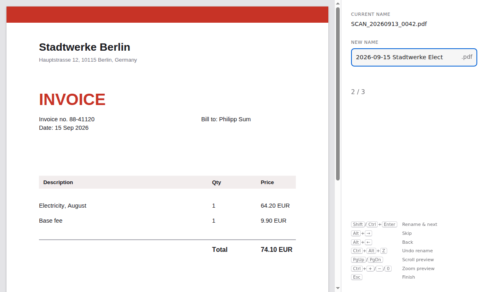

<p align="center">
  
</p>

<h1 align="center">PDF Rename</h1>

<p align="center">Rename PDFs one after another from the keyboard, with a preview.</p>

<p align="center">
  <a href="https://github.com/PSum/pdf-rename/releases/latest"></a>
  <a href="https://github.com/PSum/pdf-rename/actions/workflows/ci.yml"></a>
  <a href="LICENSE"></a>
</p>

<p align="center">
  <picture>
    <source media="(prefers-color-scheme: dark)" srcset="docs/screenshots/rename-dark.png">
    
  </picture>
</p>

Drop PDFs or a folder, type a name, press <kbd>Shift</kbd>+<kbd>Enter</kbd>. The file is renamed and the next one opens.

## Download

[Releases](https://github.com/PSum/pdf-rename/releases/latest): Windows `.exe`, macOS `.dmg` (Apple Silicon/Intel), Linux `.deb`/`.AppImage`. Installers are about 5 MB (AppImage ~80 MB), because the app uses the system's web view instead of bundling a browser.

The builds are unsigned. On Windows, go to *Properties* → *Unblock*. On macOS, right-click → *Open*.

## Keys

| Windows / Linux | macOS | |
|---|---|---|
| <kbd>Shift</kbd>/<kbd>Ctrl</kbd>+<kbd>Enter</kbd> | <kbd>Shift</kbd>/<kbd>⌘</kbd>+<kbd>Enter</kbd> | Rename, next |
| <kbd>Alt</kbd>+<kbd>→</kbd> / <kbd>←</kbd> | <kbd>⌘</kbd>+<kbd>⌥</kbd>+<kbd>→</kbd> / <kbd>←</kbd> | Next / previous |
| <kbd>Ctrl</kbd>+<kbd>Alt</kbd>+<kbd>Z</kbd> | <kbd>⌘</kbd>+<kbd>⌥</kbd>+<kbd>Z</kbd> | Undo rename |
| <kbd>Ctrl</kbd>+<kbd>+</kbd>/<kbd>-</kbd>/<kbd>0</kbd> | <kbd>⌘</kbd>+<kbd>+</kbd>/<kbd>-</kbd>/<kbd>0</kbd> | Zoom preview |
| <kbd>PgUp</kbd>/<kbd>PgDn</kbd> | <kbd>PgUp</kbd>/<kbd>PgDn</kbd> | Scroll preview |
| <kbd>Esc</kbd> | <kbd>Esc</kbd> | Finish |

`.pdf` is added automatically. Existing files are only overwritten after confirmation. Names that are invalid on Windows are rejected on every OS.

## Development

Built with [Tauri](https://tauri.app): Rust (`src-tauri/`) for file access, TypeScript and pdf.js (`src/renderer/`) for the UI. Requires Node.js 22+ and [Rust](https://rustup.rs). Linux also needs `libwebkit2gtk-4.1-dev libxdo-dev libayatana-appindicator3-dev librsvg2-dev pkg-config`.

```bash
npm install
npm run dev          # run
npm test             # TypeScript + Rust unit tests
npm run build        # installers in src-tauri/target/release/bundle/
npm run e2e          # end-to-end via tauri-driver (Linux), after: npm run tauri build -- --debug --no-bundle
```

Release: `npm version minor && git push --follow-tags`. GitHub Actions builds and publishes the installers.

## License

MIT
